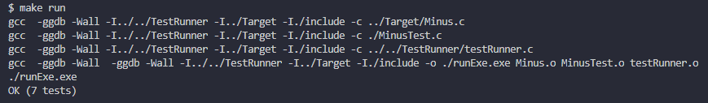

# ClangUnitTestSampleByCUnit
---
Unit test sample code for C language program with "CUnit for Mr. Ando".  

## Folder structure
---
### TestRunner

* Source codes of CUnit, free C language testing framework.
* testRunner.c / h

### MinusTest

* Test target codes and unit test codes of subtraction.
* The following result will be displayed by executing command "make run" at ./MinusTest/Test/.  

  
